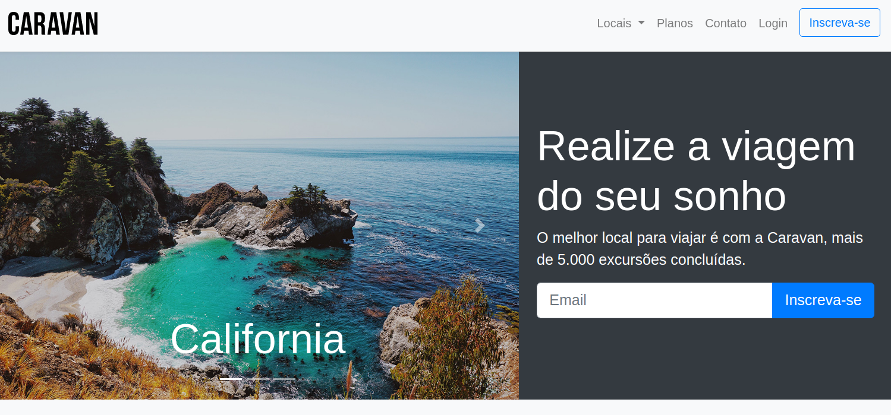

<h1 align="center">
   
  Caravan
</h1>

 Caravan - Responsive web site made with Bootstrap 4 

  

 

 

 

 

 

## Tools

   Bootstrap
 
 
## Project status 

In progress!

## License

This project is licensed under the MIT License - see the [LICENSE](https://opensource.org/licenses/MIT) page for details.

